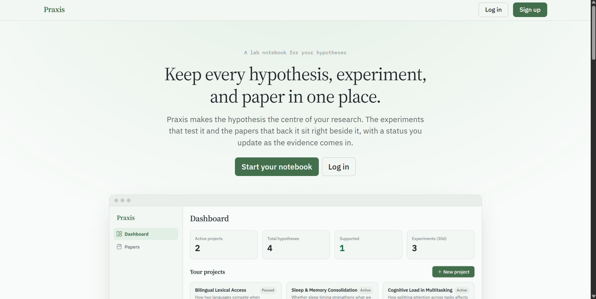

## Preview Page

Link PPT, Laporan & Poster -> https://drive.google.com/drive/folders/1RwdaBgKSBuxy8TCQlU3KeJVY3-sGq8xT?hl=ID



Praxis adalah aplikasi web kecil untuk mengorganisir penelitian dengan hipotesis sebagai satuan kerja utama.

Sebagian besar alat pencatatan dirancang untuk dokumen atau tugas. Proyek penelitian bukan keduanya. Proyek penelitian bergerak di antara beberapa hipotesis yang berbagi proyek induk yang sama, masing-masing diuji melalui serangkaian eksperimen dan didukung oleh sejumlah kecil makalah referensi. Praxis memodelkan bentuk tersebut secara tepat, tanpa berusaha menjadi basis pengetahuan generik atau sistem manajemen informasi laboratorium.

Tumpukan teknologinya sengaja dibuat sederhana. PHP 8 murni tanpa framework di sisi backend, HTML yang dirender di server dengan sedikit JavaScript vanilla di frontend, PostgreSQL di Supabase untuk penyimpanan, dan runtime vercel-php dari Vercel untuk deployment.

## Feature

- Hierarki proyek, hipotesis, dan eksperimen dengan pelacakan status (terbuka, sedang diuji, didukung, ditolak) di tingkat hipotesis.
- Catatan jurnal per hipotesis untuk observasi dan keputusan harian, disimpan terpisah dari catatan eksperimen formal.
- Pencarian makalah OpenAlex dengan tiga mode: peringkat relevansi, jumlah sitasi, dan sitasi-maju (makalah yang mengutip judul tertentu). Makalah yang disimpan dilampirkan ke suatu hipotesis.
- Penyempurnaan hipotesis berbasis AI melalui Groq, yang mengusulkan perumusan pernyataan saat ini yang lebih spesifik dan dapat diuji. Bersifat opsional, dan endpoint mengembalikan 503 apabila tidak ada kunci yang disetel.
- Ekspor Markdown dari seluruh proyek, dengan hipotesis, eksperimen, referensi, dan catatan yang disusun bertingkat di bawah judul proyek.
- Sesi berbasis database dengan cookie HttpOnly, karena `$_SESSION` tidak bertahan pada filesystem serverless.
- Token CSRF yang disimpan di baris sesi dan divalidasi pada setiap endpoint yang mengubah status, ditambah `SameSite=Strict` pada cookie sesi.
- Area admin dengan daftar pengguna yang dipaginasi, filter peran, dan statistik agregat di seluruh pengguna, proyek, hipotesis, dan eksperimen.
- Pembatasan laju per pengguna pada endpoint yang meneruskan permintaan ke API eksternal (Groq, OpenAlex), didukung oleh tabel `rate_limits`.

## Tech Stack

| Lapisan | Pilihan | Alasan |
|---------|---------|--------|
| Frontend | HTML, Bootstrap 5 via CDN, JavaScript vanilla | Tanpa langkah build. Halaman adalah file statis yang disajikan dari `public/`. |
| Backend | PHP 8, tanpa framework, PDO | Satu file per sumber daya. Tanpa router, tanpa service container, tanpa dependensi Composer saat runtime. |
| Database | PostgreSQL di Supabase | Tier gratis mencukupi untuk deployment personal. Koneksi di-pool melalui pgbouncer. |
| Deploy | Vercel `vercel-php@0.9.0` | PHP serverless untuk `/api/*`, hosting statis untuk semua yang ada di `public/`. |
| Eksternal | OpenAlex, Groq | Pencarian makalah (tidak perlu kunci) dan penyempurnaan hipotesis (kunci opsional). |

## Project Structure

```
api/        Endpoint PHP, satu file per sumber daya
  admin/    Daftar pengguna dan statistik agregat (khusus admin)
lib/        Helper database, sesi, respons, CSRF, RBAC, dan validasi
public/     Frontend statis yang disajikan di root web
database/   setup.sql dengan skema lengkap, dummy_data.sql dengan baris contoh
config/     env.example.php (env.php hanya untuk lokal dan diabaikan oleh git)
docs/       Dokumen spesifikasi dan proyek
tests/      Suite end-to-end berbasis HTTP, tidak memerlukan Composer
router.php  Router pengembangan lokal yang mencerminkan penulisan ulang vercel.json
vercel.json Konfigurasi runtime dan routing
```

## Roadmap

Beberapa arah yang sedang dipertimbangkan. Tidak ada yang sudah dikonfirmasi.

- Lampiran file pada eksperimen melalui Supabase Storage.
- Kolaborator proyek dengan akses baca atau baca-dan-tulis.
- Ekspor BibTeX untuk makalah yang disimpan.
- Ringkasan abstrak makalah yang disimpan menggunakan AI, memanfaatkan kembali integrasi Groq yang sudah ada.
- Kotak masuk bacaan agar makalah dapat ditangkap sebelum ditetapkan ke suatu hipotesis.