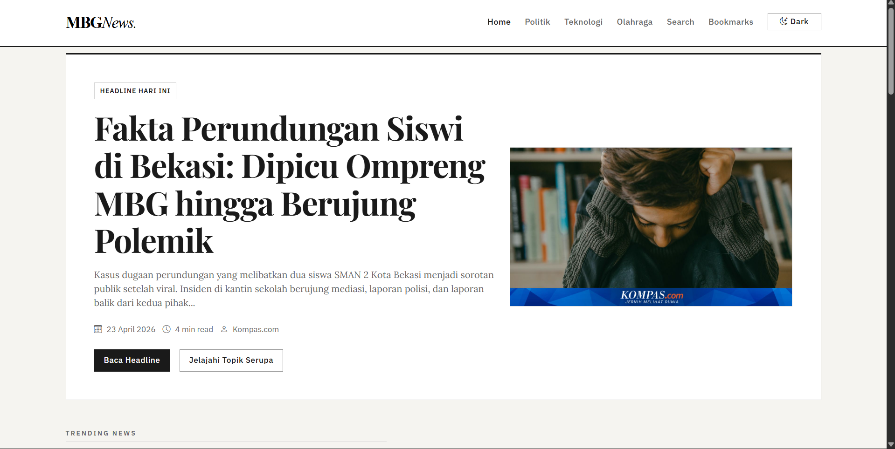

## Preview Page

Link PPT & Poster -> https://drive.google.com/drive/folders/1Ofz_on93-dfIN7MQGn0PC14m7BpYqJ49



MBGNews adalah website portal berita interaktif berbasis static frontend yang dibangun dengan HTML, CSS, JavaScript vanilla, dan Bootstrap 5. Project ini menampilkan headline dinamis, kategori berita, detail artikel dari Markdown, search biasa dan semantic-like search, serta interaksi pembaca yang disimpan secara lokal di browser.

## Fitur Utama

- Landing page dengan hero headline, trending news, latest news, dan preview kategori.
- Kategori berita `Politik`, `Teknologi`, `Olahraga`, dan `Peristiwa`.
- Halaman detail berita dengan konten Markdown yang dimuat via `fetch()`.
- Search berita dengan dua mode: `Normal Search` dan `AI Semantic Search`.
- Toggle `Dark/Light mode` di navbar dengan preferensi tersimpan setelah refresh.
- Halaman bookmark untuk berita yang ingin dibaca lagi.
- Footer seragam di semua halaman menggunakan logo MBGNews.

## Fitur AI/NLP

- `AI News Summary`: menghasilkan ringkasan 2-3 kalimat dan 3 key points berbasis rule JavaScript.
- `AI-like Semantic Search`: melakukan scoring berdasarkan title, summary, category, tag, keyword, synonym, dan partial match.

## Fitur Interaksi (Local)

- `Upvote` per berita dengan penyimpanan `localStorage`.
- `Comment` per berita dengan form nama dan pesan.
- `Delete comment` untuk komentar lokal milik user.
- `Bookmark / Read later` untuk menyimpan berita pilihan.

Semua interaksi di atas bersifat lokal per browser/perangkat karena tidak memakai backend atau database. Data tidak tersinkron antar-user maupun antar-device.

## Tech Stack dan CDN

Project ini memakai:

- HTML5
- CSS3
- JavaScript vanilla
- Bootstrap 5 via CDN
- Bootstrap Icons via CDN
- `localStorage`

Karena dependency utama dimuat lewat CDN, koneksi internet dibutuhkan saat website dibuka agar Bootstrap dan Bootstrap Icons dapat ter-load dengan benar.

## localStorage Keys

Semua key memakai prefix brand `MBGNews` dalam format berikut:

- `mbgnews_theme`
- `mbgnews_upvotes`
- `mbgnews_comments`
- `mbgnews_bookmarks`


## Struktur Folder

```text
MBGNews/
├── index.html
├── detail.html
├── category.html
├── search.html
├── bookmarks.html
├── content/
│   ├── kebakaran-di-lubang-buaya-jakarta-timur-satu-warga-meninggal.md
│   ├── pemkot-razia-besar-besaran-seluruh-daycare-di-yogyakarta-besok.md
│   ├── jogja-bentuk-tim-pendampingan-psikologis-korban-daycare-little-aresha.md
│   ├── sabotase-siber-di-iran-pakar-singgung-bom-waktu-internet-ri-dan-ruu-kks.md
│   ├── kisah-pakar-seo-aceh-taklukkan-google-hingga-miliki-toyota-supra-mk5.md
│   ├── apple-buka-developer-institute-ada-kelas-pengembangan-ai-hingga-games.md
│   ├── cerita-eko-yuli-angkat-derajat-keluarga-dari-prestasi-angkat-besi.md
│   ├── hasil-thomas-cup-dramatis-indonesia-kalahkan-thailand-3-2.md
│   ├── hasil-motogp-spanyol-marc-marquez-kecelakaan-alex-marquez-juara.md
│   └── fakta-perundungan-siswi-di-bekasi-dipicu-ompreng-mbg-hingga-berujung-polemik.md
├── assets/
│   ├── css/
│   │   └── style.css
│   ├── img/
│   │   ├── mbg-logo.svg
│   │   └── (file gambar berita)
│   └── js/
│       ├── data.js
│       ├── main.js
│       ├── detail.js
│       ├── category.js
│       ├── search.js
│       ├── bookmarks.js
│       ├── interactions.js
│       └── ai/
│           ├── ai-summary.js
│           └── ai-search.js
└── vercel.json
```
